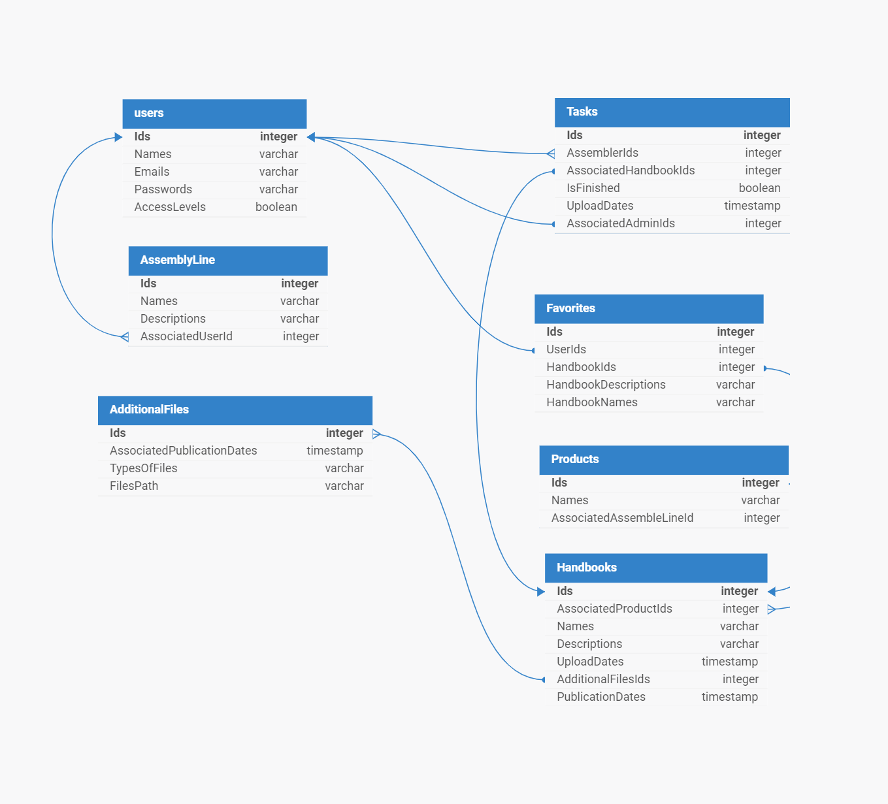

# Modelagem Relacional do Banco de Dados

&nbsp;&nbsp;&nbsp;&nbsp;O modelo de banco de dados relacional foi desenvolvido por EF Codd na década de 1970 e permite que quaisquer tabelas sejam relacionadas umas com as outras através de atributos em comum. Em sua ideia principal, Codd propôs que dados pudessem ser armazenados, relacionados e acessados sem reorganizar as tabelas que sustentam estes dados. Dessa maneira, a combinação de tabelas estabelece vinculações entre informações destas entidades, solidificando a infraestrutura geral das relações o projeto e mitigando redundância de dados.

&nbsp;&nbsp;&nbsp;&nbsp;É importante destacar que, em um modelo relacional de banco de dados, as tabelas são identificadas como **entidades** e, dentro das entidades, as colunas que especificam os dados a serem armazenados são chamadas de **atributos**. Neste momento, as **chaves primárias**, atributos de uma tabela que identificam unicamente cada registro incluído, e **chaves estrangeiras**, atributos contidos em outras tabelas que relacionam as entidades, são especificadas.

#### Modelo Relacional do Banco de Dados



#### Entidades contidas no Banco de Dados


- Users

&nbsp;&nbsp;&nbsp;&nbsp;A entidade **users** se refere aos vários usuários que possuem acesso à aplicação web, contendo informações fundamentais para a validação do usuário. Além disso, vale ressaltar que esses usuários podem ser separados em dois grupos a partir dos atributos presentes na tabela, sendo eles: Montador e Administrador.

| Atributo  | Descrção | Tipo | Tamanho |
| ------------- | ------------- |--------|-----|
| **Ids (primary key)** | Este atributo é a chave primária da tabela, sendo responsável por identificar o usuário por meio de uma sequência de números. Vale ressaltar que através do Id é possível diferenciar todos os usuários, uma vez que cada um terá um número diferente.| Inteiro|Não se aplica
| **Names** | Sabe-se que os nomes são fundamentais na identificação de uma pessoa. Portanto, foi criado este atributo para armazenar o nome de cada usuário, seja ele administrador ou funcionário. |VARCHAR| 100 caracteres
| **Emails** | Este atributo é um identificador de contato do usuário, uma vez que o e-mail é a principal ferramenta de comunicação dentro de uma empresa. Além disso, é a partir dele que é possível acessar a conta do usuário, sendo um dos componentes de validação da identidade dentro da aplicação web. | VARCHAR| 100 caracteres
| **Passwords** | Este atributo representa a senha do usuário, consistindo em uma sequência de caracteres que funciona como a principal fonte de validação. Enquanto o e-mail pode ser facilmente acessado por outras pessoas, a senha permanece confidencial, permitindo apenas ao usuário o acesso à sua conta. |VARCHAR | 60 caracteres


- Tasks

&nbsp;&nbsp;&nbsp;&nbsp; A entidade **Tasks** está relacionada à atribuição de tarefas que podem ser feitas pelo administrador, para os montadores. Desta forma, além de poder visualizar as tarefas, os montadores podem ter controle do que foi feito ou não, a partir do atributo IsFinished e também ver quais as prioridades das tarefas que lhes foram atribuídas. 

| Atributo  | Descrção | Tipo | Tamanho |
| ------------- | ------------- |--------|-----|
| **Ids (primary key)** | Este atributo é a chave primária da tabela, sendo responsável por identificar uma tarefa por meio de uma sequência de algarismos.| INTEGER |Não se aplica
| **AssemblerIds (foreign key)** | Por se tratar de uma chave estrangeira, esse atributo referência os IDs do montador da entidade users, ou seja, este atributo é utilizado para identificar o montador, e estará nesta entidade como chave estrangeira, pois é necessário que as tarefas sejam atribuídas para alguém. Desta forma, o ID representa para quem a tarefa é direcionada. |INTEGER| Não se aplica
|**AssociatedHandbookIds (foreign key)** | Por se tratar de uma chave estrangeira, esse atributo referência os IDs do manual da entidade handbooks, ou seja, este atributo é utilizado para identificar o manual, e estará nesta entidade como chave estrangeira, pois é necessário identificar quais manuais o montador deve estudar.  | INTEGER| Não se aplica
| **IsFinished** |Este atributo é responsável por definir o status da tarefa, indicando se ela foi concluída ou não. É de extrema importância para a organização do montador e o controle do administrador. | BOOLEANO| Não se aplica
| **UploadDates** |Este atributo é responsável por apresentar a data de postagem desta tarefa, na qual é possível ao montador visualizar quando esta tarefa foi atribuída a ele próprio. | TIMESTAMP | Não se aplica
| **AssociatedAdminIds (foreign key)** | Por se tratar de uma chave estrangeira, esse atributo referencia os IDs dos administradores da entidade users que estão atribuindo as tarefas em questão.| INTEGER | Não se aplica

- Favorites

&nbsp;&nbsp;&nbsp;&nbsp; A entidade **Favorites** está relacionada aos manuais favoritados pelo usuário. Dessa forma, é possível que o montador acesse todos os manuais que favoritou por meio das associações UserIds e HandbookIds, onde é atribuído ao usuário o manual específico que foi favoritado.

| Atributo  | Descrção | Tipo | Tamanho |
| ------------- | ------------- |--------|-----|
| **Ids (primary key)** | Este atributo é a chave primária desta tabela, sendo responsável por identificar os favoritos de um usuário por meio de uma sequência de números.| INTEGER|Não se aplica
| **UserIds (foreign key)** |  Por se tratar de uma chave estrangeira, esse atributo referencia os IDs dos usuários da entidade users. Ele fica responsável por identificar qual usuário é responsável por um conjunto de manuais favoritados pelo próprio. |INTEGER| Não se aplica
|**HandbookIds (foreign key)** |  Por se tratar de uma chave estrangeira, esse atributo referencia os IDs dos manuais da entidade Handbooks  que foram favoritados pelo usuário, a fim de identificar qual o manual escolhido pelo usuário. | INTEGER| Não se aplica
| **HandbookDescriptions** | Este atributo é responsável por representar a descrição dos manuais, uma vez que todo manual precisa de um texto que pode apresentar informações importantes sobre o conteúdo do manual. | VARCHAR| 200 caracteres
| **HandbookNames** | Este atributo é responsável por representar os nomes dos manuais, ou seja, como eles devem ser identificados para facilitar o entendimento do que se trata o material rapidamente. |VARCHAR | 100 caracteres  

- Products

&nbsp;&nbsp;&nbsp;&nbsp; A entidade **Products** representa os produtos que serão produzidos nas linhas de montagem, exemplificando a mercadoria final. Além disso, são alocadas as informações sobre quais linhas de montagem serão responsáveis pela produção de cada um deles.

| Atributo  | Descrção | Tipo | Tamanho |
| ------------- | ------------- |--------|-----|
| **Ids (primary key)** | Este atributo é a chave primária desta tabela, sendo responsável por identificar os produtos produzidos na fábrica da Dell por meio de uma sequência de números.| INTEGER|Não se aplica
| **Names** |  Esse atributo é responsável por representar o nome do produto que será produzido, a fim de exemplificar para os usuários sobre qual produto será montado a partir dos manuais ou das tarefas atribuídas. |VARCHAR| 100 caracteres
|**AssociatedAssemblyLineID (foreign key)** |   Por se tratar de uma chave estrangeira, este atributo refere-se às linhas de montagem que foram alocadas para montar determinado produto, que serão definidas a partir dos IDs e nomes apresentados nos dois atributos acima.  | INTEGER| Não se aplica

- Handbooks

&nbsp;&nbsp;&nbsp;&nbsp;A entidade **Handbooks** representa os manuais disponíveis dentro da aplicação web, permitindo identificá-los pelos seus IDs e nomes. Além disso, contém informações fundamentais como descrição e data de postagem, para que o usuário possa se informar sobre o manual e sua atualização.

| Atributo  | Descrção | Tipo | Tamanho |
| ------------- | ------------- |--------|-----|
| **Ids (primary key)** | Este atributo é a chave primária desta tabela, sendo responsável por identificar os manuais por meio de uma sequência de números.| INTEGER|Não se aplica
| **Names** | Este atributo é responsável por representar o nome do manual, do qual o usuário estará tendo contato. |VARCHAR| 100 caracteres
|**AssociatedProductIds (foreign key)** |  Por se tratar de uma chave estrangeira, esse atributo referencia os IDs dos produtos associados aos manuais, presente na tabela products. | INTEGER| Não se aplica
| **Descriptions** | Este atributo é responsável por representar a descrição dos manuais, uma vez que todo manual precisa de um texto que pode apresentar informações importantes sobre o conteúdo do manual. | VARCHAR| 200 caracteres
| **UploadDates** | Esse atributo representa as datas em que os manuais foram postados ou atualizados dentro da aplicação web. | TIMESTAMP | Não se aplica
| **AdditionalFilesIds (foreign key)** |  Por se tratar de uma chave estrangeira, esse atributo referencia os IDs dos manuais que podem ser adicionados pelos administradores, da tabela AdditionalFiles. Quando o administrador adiciona um manual, o ID atribuído a ele estará presente neste atributo. | INTEGER | Não se aplica

- AdditionalFiles

&nbsp;&nbsp;&nbsp;&nbsp;A entidade **AdditionalFiles** representa os manuais que serão adicionados no banco de dados, portanto, é necessário incluir todas as informações relacionadas a eles, como: ID, data de publicação, tipo do documento e os caminhos de acesso ao documento. O que é apresentado nessa entidade.

| Atributo  | Descrção | Tipo | Tamanho |
| ------------- | ------------- |--------|-----|
| **Ids (primary key)** |  Este atributo é a chave primária desta tabela, sendo responsável por identificar os manuais que forem lançados na aplicação web.| INTEGER|Não se aplica
| **AssociatedPublicationDates** | Neste atributo estarão presentes as datas de publicação dos manuais que foram lançados no sistema. |TIMESTAMP| Não se aplica
|**TypesOfFiles** | Neste atributo estarão presentes as informações dos tipos de arquivos apresentados nos manuais, como por exemplo, vídeos e PDFs. | VARCHAR | 100 caracteres
|**FilesPath** | Neste atributo estarão presentes as informações dos caminhos para ter acesso ao manual em questão, disponíveis por meio de links que redirecionam aos arquivos referentes.  | VARCHAR | 100 caracteres

- AssemblyLine

&nbsp;&nbsp;&nbsp;&nbsp; A entidade **AssemblyLine** é responsável por apresentar informações sobre as linhas de montagem, as quais devem possuir ID, nomes, descrição e o ID do administrador responsável, para que o montador consiga identificar em qual linha deve estar atrelado. Além disso, terá o ID do responsável pela linha para identificação de quem a coordena.

| Atributo  | Descrção | Tipo | Tamanho |
| ------------- | ------------- |--------|-----|
| **Ids (primary key)** |  Este atributo é a chave primária desta tabela, sendo responsável por identificar as linhas de montagem presentes na empresa Dell Technologies.| INTEGER|Não se aplica
| **Names** | Este atributo é responsável por representar o nome da linha de produção na qual o montador trabalha |VARCHAR| 100 caracteres
|**Descriptions** | Este atributo é responsável por representar a descrição das linhas de montagem, apresentando informações sobre o que se faz nessa linha e qual produto é montado. | VARCHAR | 200 caracteres
|**AssociatedUserId (foreign key)** |  Por se tratar de uma chave estrangeira, este atributo refere-se ao ID do usuário relacionado a linha de montagem em questão, presente na tabela users. | INTEGER | Não se aplica


#### Relacionamento entre entidades

&nbsp;&nbsp;&nbsp;&nbsp;Os relacionamentos entre entidades são associações essenciais entre dados contidos em duas ou mais entidades. Tais relações são de extrema importância em um banco de dados, uma vez que agregam valor relacional entre diferentes conjuntos de dados.

&nbsp;&nbsp;&nbsp;&nbsp;Para consolidação das relações entre entidades são definidas chaves estrangeiras entre o conjunto de atributos de uma entidade, ou seja, atributos em uma entidade que referenciam valores de atributos definidos em outras estruturas (usualmente uma chave primária).

&nbsp;&nbsp;&nbsp;&nbsp;As relações entre as entidades de um modelo relacional de banco de dados podem ser identificadas entre as classificações contidas abaixo:

- Relacionamento Um para Um:

&nbsp;&nbsp;&nbsp;&nbsp;Em relacionamentos Um para Um (1 para 1), cada registro em uma entidade possui exatamente um registro correspondente na entidade secundária deste relacionamento.

- Relacionamento Um para Muitos:

&nbsp;&nbsp;&nbsp;&nbsp;Relacionamentos Um para Muitos (1 para N) são caracterizados por associações em que um específico registro em uma entidade pode ser associado com zero, um, ou muitos diferentes registros em uma segunda tabela. Este é o tipo de relacionamento mais comum na modelagem de bancos de dados.

- Relacionamento Muitos para Muitos:

&nbsp;&nbsp;&nbsp;&nbsp;Os relacionamentos Muitos para Muitos (N para N) representam casos em que, para cada um dos atributos associados nas duas entidades muitos outros registros podem ser correlacionados.

&nbsp;&nbsp;&nbsp;&nbsp;Usualmente, durante o desenvolvimento do banco de dados, relacionamentos N para N exigem a criação de outra tabela intermediária chamada de Tabela de Conexão. Esta entidade auxiliar possibilita a conversão do relacionamento N para N entre as duas entidades iniciais para dois relacionamentos 1 para N entre a entidade primária, tabela de conexão e a entidade secundária.

#### Relacionamentos entre entidades

&nbsp;&nbsp;&nbsp;&nbsp;Durante a modelagem de nosso banco de dados, relacionamos nossas entidades em congruência com as necessidades levantadas nas User Stories desenvolvidas pelo grupo.

- Users e AssemblyLines

&nbsp;&nbsp;&nbsp;&nbsp;A relação entre a tabela Users e AssemblyLines é de N para 1, já que podem haver muitos funcionários se relacionando com apenas uma (e apenas uma) linha de montagem por vez.

- Users e Favorites

&nbsp;&nbsp;&nbsp;&nbsp;Users e Favorites possuem associação 1 para 1, uma vez que um usuário terá apenas uma página de favoritos contendo seus manuais favoritos.

- Users e Tasks

&nbsp;&nbsp;&nbsp;&nbsp;As entidades Users e Tasks possuem relacionamento 1 para N, em que uma Task de estudo dos manuais pode ser atribuída para diversos usuários ao mesmo tempo.

- AssemblyLine e Products

&nbsp;&nbsp;&nbsp;&nbsp;As tabelas AssemblyLines e Products possuem relação 1 para N, já que uma mesma linha de montagem pode conter diversos produtos para produção.

- Favorites e Handbooks

&nbsp;&nbsp;&nbsp;&nbsp;A entidade Favorites se relaciona com Handbooks em associação 1 para 1, já que para cada item favorito adicionado, um único manual é associado ao item.

- Products e Handbooks

&nbsp;&nbsp;&nbsp;&nbsp;Similar à relação entre Favorites e Handbooks, as tabelas Products e Handbooks também se relacionam 1 para 1, uma vez que há apenas um (e apenas um) manual para cada produto.

- Handbooks e Tasks

&nbsp;&nbsp;&nbsp;&nbsp;As entidades Handbooks e Tasks possuem associação 1 para 1, uma vez que para cada tarefa definida na tabela Tasks, há relação com apenas um manual.

- Handbooks e AdditionalFiles

&nbsp;&nbsp;&nbsp;&nbsp;A tabela Handbooks se associa com AdditionalFiles em um relacionamento 1 para N, uma vez que poderão haver muitos arquivos adicionais para cada manual de produto.


#### Modelagem Física do Banco de Dados

&nbsp;&nbsp;&nbsp;&nbsp;A modelagem física de um banco de dados deriva de seu modelo relacional e transforma a idealização inicial em estruturas específicas e definidas para o desenvolvimento do banco de dados. Em um Modelo Físico de Banco de Dados, as entidades se transformam em tabelas e os atributos são denominados de colunas das tabelas.

&nbsp;&nbsp;&nbsp;&nbsp;As colunas definidas contém detalhes cruciais para o desenvolvimento do código do banco de dados, contendo o tipo de dado a ser armazenado (strings, inteiros, timestamp, boolean, etc.) e especifica as relações entre **chaves primárias** e **chaves estrangeiras**. Os valores dos dados são alocados nas linhas da tabela. 

&nbsp;&nbsp;&nbsp;&nbsp;Os bancos de dados relacionais são uma maneira intuitiva para estruturação de dados, além de facilitar processos CRUD (Criação, Leitura, Atualização e Remoção) nas tabelas. Estas estruturas de dados são frequentemente utilizadas em projetos que lidam com grandes quantidades de dados, uma vez que através da organização dos registros em uma infraestrutura relacional, a realização de consultas complexas torna-se muito mais simples.

&nbsp;&nbsp;&nbsp;&nbsp;Código em SQL do Modelo Físico do Banco de Dados do Projeto Dell:

```sql
CREATE TABLE IF NOT EXISTS "users" (
	"Ids" bigint GENERATED ALWAYS AS IDENTITY NOT NULL UNIQUE,
	"Names" text NOT NULL,
	"Emails" text NOT NULL,
	"Passwords" text NOT NULL,
	"AccessLevels" boolean NOT NULL,
	PRIMARY KEY ("Ids")
);

CREATE TABLE IF NOT EXISTS "Handbooks" (
	"Ids" bigint GENERATED ALWAYS AS IDENTITY NOT NULL UNIQUE,
	"AssociatedProductIds" bigint NOT NULL,
	"Names" text NOT NULL,
	"Descriptions" text NOT NULL,
	"UploadDates" timestamp with time zone NOT NULL,
	"AdditionalFilesIds" bigint NOT NULL,
	"PublicationDates" timestamp with time zone NOT NULL,
	PRIMARY KEY ("Ids")
);

CREATE TABLE IF NOT EXISTS "Tasks" (
	"Ids" bigint GENERATED ALWAYS AS IDENTITY NOT NULL UNIQUE,
	"AssemblerIds" bigint NOT NULL,
	"AssociatedHandbookIds" bigint NOT NULL,
	"IsFinished" boolean NOT NULL,
	"UploadDates" timestamp with time zone NOT NULL,
	"AssociatedAdminIds" bigint NOT NULL,
	PRIMARY KEY ("Ids")
);

CREATE TABLE IF NOT EXISTS "Favorites" (
	"Ids" bigint GENERATED ALWAYS AS IDENTITY NOT NULL UNIQUE,
	"UserIds" bigint NOT NULL,
	"HandbookIds" bigint NOT NULL,
	"HandbookDescriptions" text NOT NULL,
	"HandbookNames" text NOT NULL,
	PRIMARY KEY ("Ids")
);

CREATE TABLE IF NOT EXISTS "AssemblyLine" (
	"Ids" bigint GENERATED ALWAYS AS IDENTITY NOT NULL UNIQUE,
	"Names" text NOT NULL,
	"Descriptions" text NOT NULL,
	"AssociatedUserId" bigint NOT NULL,
	PRIMARY KEY ("Ids")
);

CREATE TABLE IF NOT EXISTS "Products" (
	"Ids" bigint GENERATED ALWAYS AS IDENTITY NOT NULL UNIQUE,
	"Names" text NOT NULL,
	"AssociatedAssembleLineId" bigint NOT NULL,
	PRIMARY KEY ("Ids")
);

CREATE TABLE IF NOT EXISTS "AdditionalFiles" (
	"Ids" bigint GENERATED ALWAYS AS IDENTITY NOT NULL UNIQUE,
	"AssociatedPublicationDates" timestamp with time zone NOT NULL,
	"TypesOfFiles" text NOT NULL,
	"FilesPath" text NOT NULL,
	PRIMARY KEY ("Ids")
);


ALTER TABLE "Handbooks" ADD CONSTRAINT "Handbooks_fk1" FOREIGN KEY ("AssociatedProductIds") REFERENCES "Products"("Ids");

ALTER TABLE "Handbooks" ADD CONSTRAINT "Handbooks_fk5" FOREIGN KEY ("AdditionalFilesIds") REFERENCES "AdditionalFiles"("Ids");
ALTER TABLE "Tasks" ADD CONSTRAINT "Tasks_fk1" FOREIGN KEY ("AssemblerIds") REFERENCES "users"("Ids");

ALTER TABLE "Tasks" ADD CONSTRAINT "Tasks_fk2" FOREIGN KEY ("AssociatedHandbookIds") REFERENCES "Handbooks"("Ids");

ALTER TABLE "Tasks" ADD CONSTRAINT "Tasks_fk5" FOREIGN KEY ("AssociatedAdminIds") REFERENCES "users"("Ids");
ALTER TABLE "Favorites" ADD CONSTRAINT "Favorites_fk1" FOREIGN KEY ("UserIds") REFERENCES "users"("Ids");

ALTER TABLE "Favorites" ADD CONSTRAINT "Favorites_fk2" FOREIGN KEY ("HandbookIds") REFERENCES "Handbooks"("Ids");
ALTER TABLE "AssemblyLine" ADD CONSTRAINT "AssemblyLine_fk3" FOREIGN KEY ("AssociatedUserId") REFERENCES "users"("Ids");
ALTER TABLE "Products" ADD CONSTRAINT "Products_fk2" FOREIGN KEY ("AssociatedAssembleLineId") REFERENCES "AssembleLine"("Ids");
```